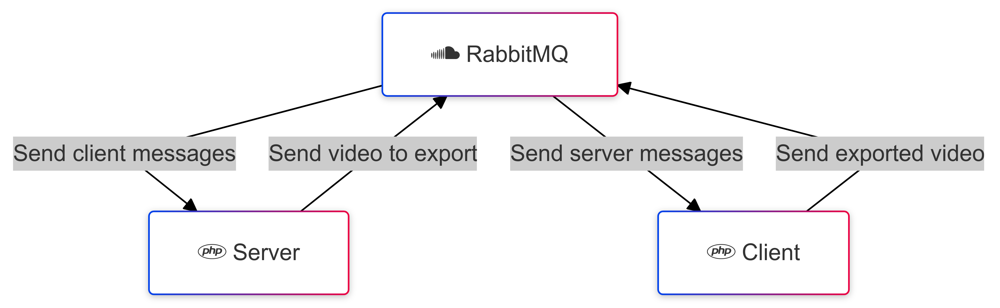

# TD Docker

## Build

Run : ```docker build -t phpdocker .```

- The dockerfile will create an image, extending the PHP8.2-cli-alpine one.
- Then add the needed binaries.
- Then install composer and php extensions.
- And finally clone source git and install dependencies.

## Compose 

Run : ```docker-compose up --build```

- The composer will create 3 services :
  - A container rabbitmq for communication between server and client
  - A container php-server to run the server.php script (base on the phpdocker image built before)
  - A container php-client to run the client.php script (base on the phpdocker image built before)
- We create also a volume rabbitmq_data to make the datas of rabbitmq persistent through builds

Because the PHP scripts that php-server and php-client will run need to connect to rabbitmq, we need to ensure that rabbitmq is launched before launch them.</br>
We can do that by adding an ```healthcheck``` into the compose of rabbitmq, and a ```depend_on``` condition for the two PHP services.</br>
The service will be considered as "healthy" if the test command doesn't return an error.</br>
The composer will retry a given number of times, waiting a given amount of time before aborting.</br>
If one of the test judge the service healthy, we can compose the two others services.</br>
Else, the services won't be launched.

## Workflow


